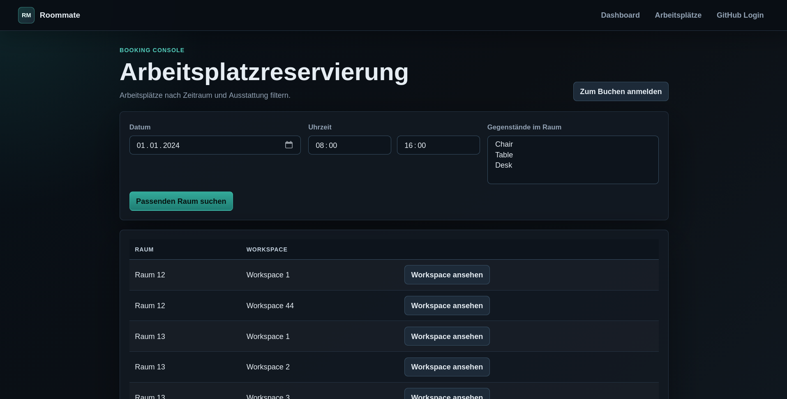

<p align="center" style="margin-bottom: 0; padding: 0">
<a href="https://github.com/team_propra/roommate/">

</a>
</p>
<h1 align="center" style="margin-top: 0; padding: 0">
  Roommate
</h1>
<p align="center">
  <a href="https://codecov.io/github/team-propra/roommate">
    
  </a>

  <a href="https://github.com/team-propra/roommate/actions/workflows/cd.yml">
    
  </a>

  <a href="https://www.conventionalcommits.org/en/v1.0.0/">
    
  </a>

  <a href="https://adoptium.net/temurin/releases/?version=21">
    
  </a>
</p>
<p align="center">
  <a href="https://github.com/team_propra/roommate/">
    
  </a>
</p>
<p align="center">
By 
  <a href="https://github.com/nighoge">
    nighoge
  </a> |
  <a href="https://github.com/AhoiKrause">
    AhoiKrause
  </a> |
  <a href="https://github.com/F3lixLoch">
    F3lixLoch
  </a> |
  <a href="https://github.com/themassiveone/">
    themassiveone
  </a>
</p>

## Getting Started

You need Java 21 and a working Docker CLI, then run:

```shell
./gradlew bootRun
```

The application starts on http://localhost:8080. It automatically starts ephemeral Postgres and Keymaster containers and stops them when the application stops.

GitHub OAuth is optional for local browsing. Without OAuth credentials you can use Roommate as a guest, inspect rooms and workspaces, and search availability. Booking rooms and admin actions require GitHub login and a verified/admin user.

## About

Roommate is a room booking software. It was a team project created as part of a module at university.

The project came with a set of challenges:
- External dependency: Key management software (keymaster.jar), cannot be manipulated
- Authentication via GitHub OAuth
- Strict onion architecture

Required features:
- Use case: Admins manage workspaces and rooms
- Use case: Users search and book rooms

## Demo

A public demo is hosted [here](https://roommate.massivecreationlab.com). Contact us for admin access.

## Deploy Roommate

### GitHub OAuth

GitHub OAuth is required for booking and admin flows. Guests can still browse without it.

Go to https://github.com/settings/applications/new and create an OAuth application.
- `name`: whatever
- `home-page url`: `http://localhost:8080` or your hosted domain
- `authorization callback url`: `http://localhost:8080/login/oauth2/code/github` or `https://your-domain/login/oauth2/code/github`

Store the generated client ID and client secret securely.

For hosted deployments, the callback URI can also be set explicitly with `OAUTH2_GITHUB_REDIRECT_URI`. The Helm chart defaults it to `https://<ingress.host>/login/oauth2/code/github`.

### IntelliJ IDEA

No environment variables are required for guest-only local browsing. If you want to test GitHub login, add these environment variables to your Spring Boot run configuration:
- Go to RunConfigurations > Edit (top right)
- Edit the Spring Boot Configuration for this project
- ModifyOptions > EnvironmentVariables
- Enter environment variables as one string like this: `CLIENT_ID=***;CLIENT_SECRET=***`

Common local variables:
- `ADMIN_HANDLE=YOUR_GITHUB_HANDLE` (_In case you want to test the application as an admin_)
- `CLIENT_ID=YOUR_CLIENT_ID`
- `CLIENT_SECRET=YOUR_CLIENT_SECRET`
- `OAUTH2_GITHUB_REDIRECT_URI=http://localhost:8080/login/oauth2/code/github`

If you want to connect to external infrastructure instead of the automatic local containers, configure both:
- `SPRING_DATASOURCE_EXTERNAL=true`
- `SPRING_DATASOURCE_URL=jdbc:postgresql://HOST:PORT/postgres`
- `SPRING_DATASOURCE_USERNAME=YOUR_POSTGRES_USER`
- `SPRING_DATASOURCE_PASSWORD=YOUR_POSTGRES_PASSWORD`
- `ROOMMATE_KEY_MASTER_EXTERNAL=true`
- `ROOMMATE_KEY_MASTER_URL=HOST`
- `ROOMMATE_KEY_MASTER_PORT=3000`

### Docker Compose

Before using `docker compose up`, create an `.env` file according to [example.env](./example.env) and set its values accordingly. Docker Compose starts Roommate, Postgres, and Keymaster as separate services.

### Kubernetes With Helm

Below is a minimal Kubernetes deployment using the Helm chart. The chart deploys Postgres and Keymaster by default and configures Roommate to use those chart-managed services.

Create a `values.yaml` file and specify your host and secrets:

```yaml
namespace: roommate
ingress:
  host: ""
database:
  port: 5432
  containerPort: 5432
  user: ""
  password: ""
keymaster:
  port: 3000
  containerPort: 3000
roommate:
  adminHandle: ""
  clientId: ""
  clientSecret: ""
  oauthRedirectUri: ""
```

Then deploy the application:

```shell
helm install roommate-helm \
  oci://registry.massivecreationlab.com/roommate \
  -n roommate \
  --create-namespace \
  -f values.yaml
```

## Documentation
For an overview of the project's scope, basic architecture and goals & requirements see our [documentation](./docs/RoomMate_doc.md).
