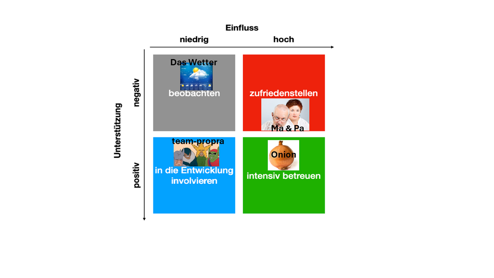
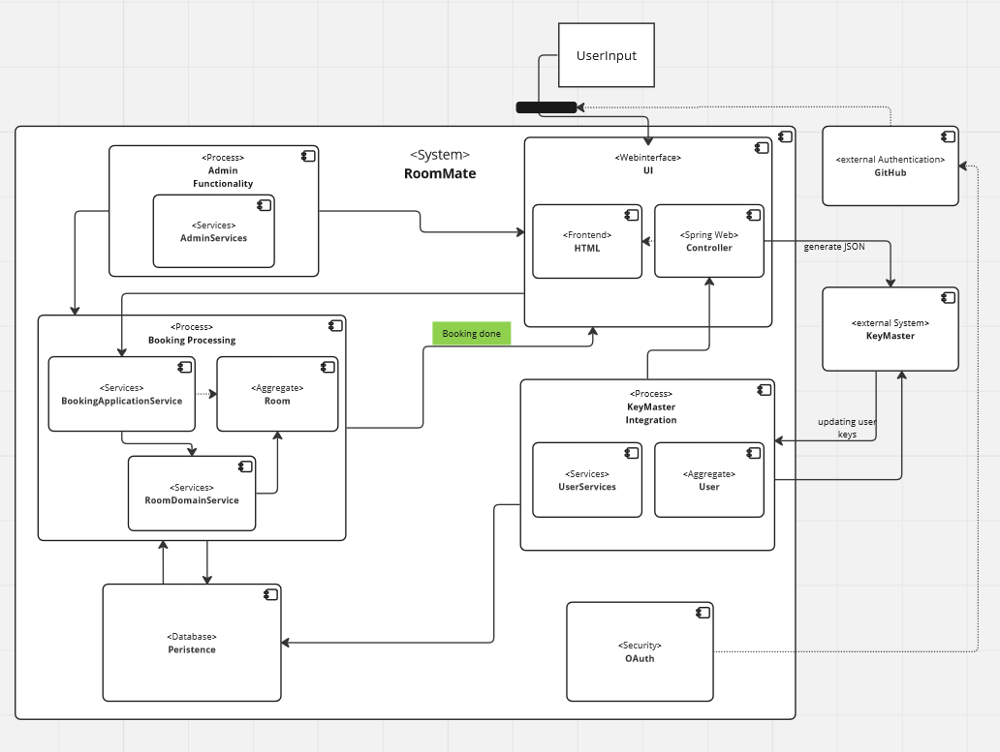

# 
RoomMate Documentation

# Introduction and Goals
 This project was created as part of the "Programming Practical 2" module at Heinrich Heine University Düsseldorf. For the project ..., ..., ... and ... contributed to the project. The aim of the project was to create a complete web application for a room booking software. The goals and requirements of the project were defined as follows:
 

_picture: Detailed descriptioned of overall goals and requirements for RoomMate_
## Stakeholders

_picture: very serious stakeholder analysis. We aim to please these people._

| Role/Name     |  Expectations                                                                                                                                                                                                                                                                                                                                                                                                                                                                                                                   |
|---------------|---------------------------------------------------------------------------------------------------------------------------------------------------------------------------------------------------------------------------------------------------------------------------------------------------------------------------------------------------------------------------------------------------------------------------------------------------------------------------------------------------------------------------------|
| *Wetter*      | *Teller aufessen*                                                                                                                                                                                                                                                                                                                                                                                                                                                                                                              |
| *team-propra* | *Projekt bestehen*                                                                                                                                                                                                                                                                                                                                                                                                                                                                                                             |
| *Ma & Pa*     |*Doktor werden*                                                                                                                                                                                                                                                                                                                                                                                                                                                                                                                |
| *Onion*       | *(')Als Zwiebel der Weisheit hoffe ich, dass ihr als Junior-Entwickler euren Horizont erweitert und eure Fähigkeiten schält, um die Kernprobleme zu lösen. Lasst uns gemeinsam in die Tiefen des Codes eindringen und jede Schicht der Herausforderung enthüllen. Vergesst nicht, dass auch in der Entwicklerwelt Tränen fließen können, aber es ist die süße Ernte unseres Fortschritts, die uns tränenfrei macht. Seid mutig, schält euch durch den Code-Dschungel und werdet zu den scharfen Köpfen, die diese Welt würzen.* |

'(generated by ChatGPT, https://chat.openai.com)

# System Scope and Context

_picture: Context Diagram for RoomMate_
*   **User**: Searches rooms for existing items and available times and books them.
*   **Admin**: Manages active bookings and is also able to delete them. Creates new rooms and fills their workstations with items
*   **KeyMaster**: Software for Door-Locking Management. Requires regularly updated information from RoomMate. Is able to generate User-Keys and rooms.
*   **Github**: Is used for OAuth authentication.

# Building Block View

**Abstract view**

_picture: Abstract component diagram of RoomMate_

| **Name**                | **Description**                                                                                                                                                                                                                               |
|-------------------------|-----------------------------------------------------------------------------------------------------------------------------------------------------------------------------------------------------------------------------------------------|
| *Booking Processing*    |  *A collection of services and domain logic to provide the booking of rooms for users*                                                                                                                                                        |
| *Persistence*           |  *Postgres databse implemented by JDBC Data*                                                                                                                                                                                                  |
 | *KeyMaster Integration* |  *Verifies users by creating a keyID on KeyMaster while regularly updating it, which enables users to book rooms. Provides REST interface via ApiController for updating access lists on KeyMaster by associating user keys to room bookings* |
| *UI & Controller*       |  *Webinterface supported by Spring Web*                                                                                                                                                                                                       |
| *OAuth*                 |  *Authentification through GitHub OAuth using Spring Security*                                                                                                                                                                                |
                                                                                                                                                                                                                                         |

# Glossary

The most important domain and technical terms that your stakeholders use
when discussing the system.

You can also see the glossary as source for translations if you work in
multi-language teams.

| Term            | Definition                                                           |
|-----------------|----------------------------------------------------------------------|
| *abstract view* | *Our Monolithic architecture view covering level 1 and 2 components* |

