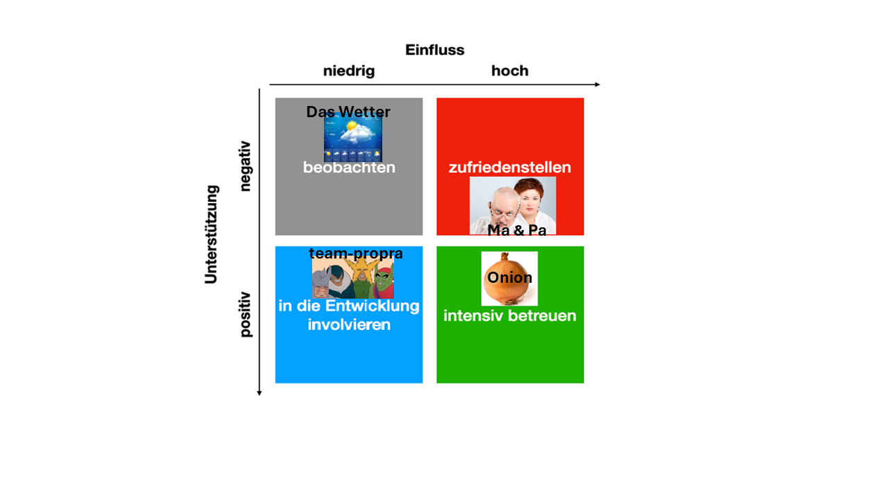
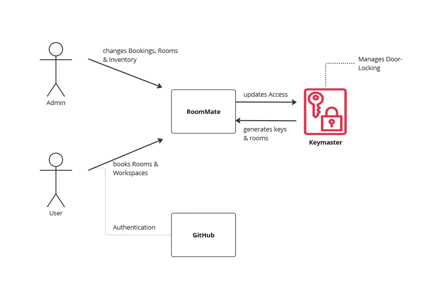
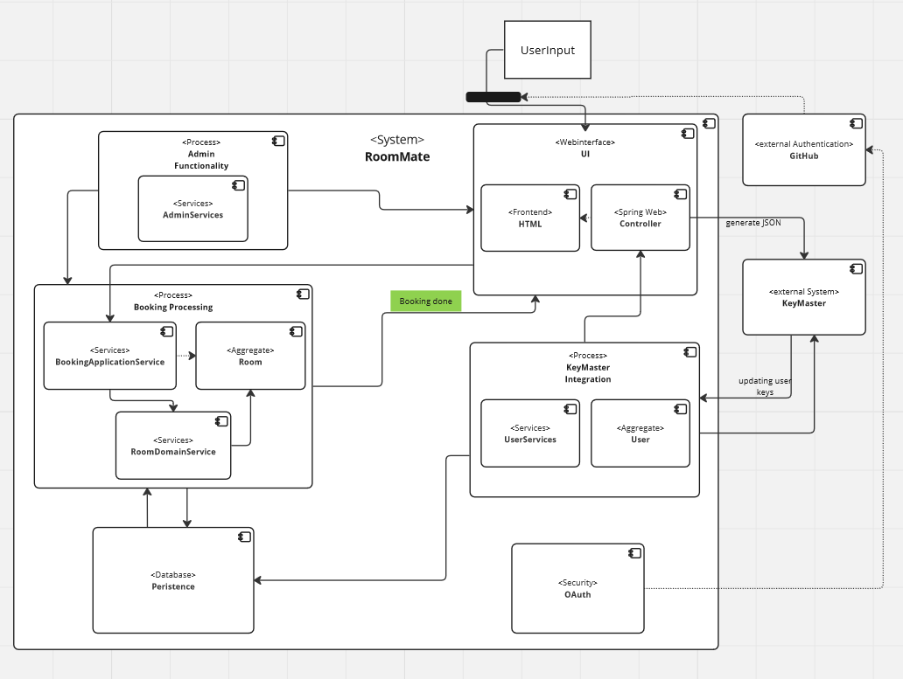

# 
RoomMate Documentation

# Introduction and Goals
 This project was created as part of the module "Programmierpraktikum 2" at Heinrich Heine University Düsseldorf. Daniel Maß ([@themassiveone](https://github.com/themassiveone)), Till Schellscheidt ([@nighoge](https://github.com/nighoge)), Felix Loch ([@F3lixLoch](https://github.com/F3lixLoch)) and Timm Krause ([@AhoiKrause](https://github.com/AhoiKrause)) contributed to the project. The aim of the project was to create a complete web application for a room booking software. The goals and requirements of the project were defined as follows:
 

**Adequate modelling of business logic**
- suitable decomposition of logic into sensibly structured aggregates
- sensible use of data structures, avoiding primitive obsession
- keeping our code [DRY](https://en.wikipedia.org/wiki/Don%27t_repeat_yourself)
- writing web controller without domain logic and fex parameters

**Accessibility**
- all graphics must have an 'alt' attribute
- sensible use of tags (f.ex. table, ol, ul) in our HTML
- useful navigation with a screen-reader and without mouse

**Architecture**
- implementing an 'Onion Architecture'
- measures to ensure that the architecture is adhered to (f.ex. Arch-Unit tests)
- a correct connection of KeyMaster into its own adapter

**Authentication and authorization**
- different levels of authorization (regular users vs. admins)
- not allowing access to resources without proper authorization
- guaranteeing that future changes to the system will not allow unauthorized access
- no passwords or secrets have ever been checked into the Git history

**Deployment**
- making an application that is ready for deployment on a server
- having a docker-compose file and being able to build the application with _./gradlew bootJar_
- being able to start the application from the terminal with _java -jar 'name of jar-file'_

**Code consistency**
- using a style guide
- using common conventions in Java
- checking our codes via SpotBugs

**Documentation**
- using the [arch42](https://arc42.org/) template
- including diagrams for context and scope
- having a level-1 view of the application with explanations

**Functionality**
- admins manage workspaces, users book workspaces. Both have sensible work flows
- no bookings are allowed that have overlapping time frames
- After automatic synchronization, the assignment is displayed in KeyMaster

**Git Commits**
- clear commits that represent a single unit and have great commit messages
- no commit may contain the database data

**Testing**
- sensible testing, having a variety of integration and unit tests
- keeping a good test coverage. Aiming between 80 and 90%
- test have minimal scope and use mocks only if necessary
- structuring our tests according to [AAA](https://automationpanda.com/2020/07/07/arrange-act-assert-a-pattern-for-writing-good-tests/)
- naming our tests according to their behaviour
- decoupling our tests by using builders, object mothers or factories

## Stakeholders

_picture: very serious stakeholder analysis. We aim to please these people._

| Role/Name     |  Expectations                                                                                                                                                                                                                                                                                                                                                                                                                                                                                                                   |
|---------------|---------------------------------------------------------------------------------------------------------------------------------------------------------------------------------------------------------------------------------------------------------------------------------------------------------------------------------------------------------------------------------------------------------------------------------------------------------------------------------------------------------------------------------|
| *Wetter*      | *Teller aufessen*                                                                                                                                                                                                                                                                                                                                                                                                                                                                                                              |
| *team-propra* | *Projekt bestehen*                                                                                                                                                                                                                                                                                                                                                                                                                                                                                                             |
| *Ma & Pa*     |*Doktor werden*                                                                                                                                                                                                                                                                                                                                                                                                                                                                                                                |
| *Onion*       | *(')Als Zwiebel der Weisheit hoffe ich, dass ihr als Junior-Entwickler euren Horizont erweitert und eure Fähigkeiten schält, um die Kernprobleme zu lösen. Lasst uns gemeinsam in die Tiefen des Codes eindringen und jede Schicht der Herausforderung enthüllen. Vergesst nicht, dass auch in der Entwicklerwelt Tränen fließen können, aber es ist die süße Ernte unseres Fortschritts, die uns tränenfrei macht. Seid mutig, schält euch durch den Code-Dschungel und werdet zu den scharfen Köpfen, die diese Welt würzen.* |

'(generated by [ChatGPT](https://chat.openai.com))

# System Scope and Context

_picture: Context Diagram for RoomMate_
*   **User**: Searches rooms for existing items and available times and books them.
*   **Admin**: Manages active bookings and is also able to delete them. Creates new rooms and fills their workstations with items
*   **KeyMaster**: Software for Door-Locking Management. Requires regularly updated information from RoomMate. Is able to generate User-Keys and rooms.
*   **GitHub**: Is used for OAuth authentication.

# Building Block View

**Abstract view**

_picture: Abstract component diagram of RoomMate_

| **Name**                | **Description**                                                                                                                                                                                                                               |
|-------------------------|-----------------------------------------------------------------------------------------------------------------------------------------------------------------------------------------------------------------------------------------------|
| *Booking Processing*    |  *A collection of services and domain logic to provide the booking of rooms for users*                                                                                                                                                        |
| *Persistence*           |  *Postgres database implemented by JDBC Data*                                                                                                                                                                                                 |
 | *KeyMaster Integration* |  *Verifies users by creating a keyID on KeyMaster while regularly updating it, which enables users to book rooms. Provides REST interface via ApiController for updating access lists on KeyMaster by associating user keys to room bookings* |
| *UI*                    |  *Webinterface supported by Spring Web*                                                                                                                                                                                                       |
| *OAuth*                 |  *Authentication through GitHub OAuth using Spring Security*                                                                                                                                                                                  |
| *Admin Functionality*   |  *Provides general admin functionality by adding rooms and items.*                                                                                                                                                                            |

# Glossary

| Term            | Definition                                                                           |
|-----------------|--------------------------------------------------------------------------------------|
| *abstract view* | *Our Monolithic architecture view covering level 1 and 2 components*                 |
| *KeyMaster*     | *An external system used for Door-Locking management, with which RoomMate interacts* |

